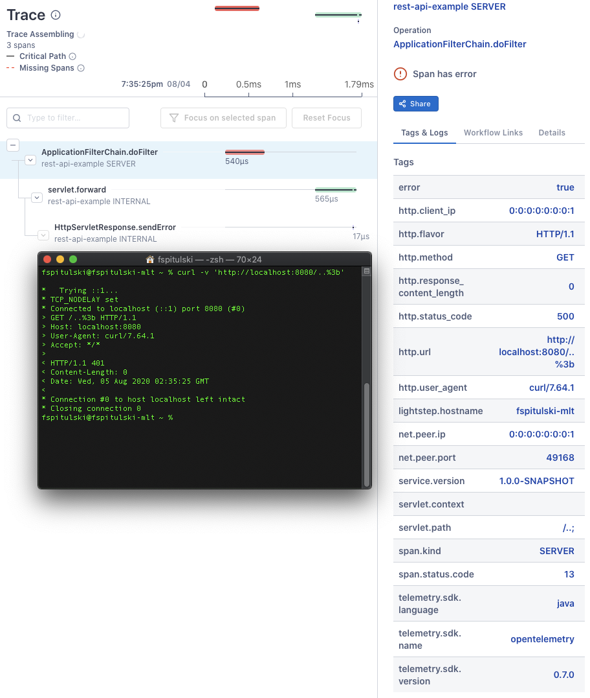

# rest-api-example for otel

my setup

```shell script
wget https://github.com/open-telemetry/opentelemetry-java-instrumentation/releases/latest/download/opentelemetry-javaagent-all.jar
mvn clean package && \
java \
  -javaagent:`pwd`/opentelemetry-javaagent-all.jar \
  -Dotel.exporter=logging \
  -Dotel.propagators=ottracer \
  -jar target/app.jar
```

invoke a 401 with
```shell script
curl -v 'http://localhost:8080/..%3b'
```

view the trace. note that the http.status_code tag is 500 while the response code is 401.

Lightstep exporter


Logging exporter
```text
Logging Exporter: ApplicationFilterChain.doFilter c62e0456f29b8ed3 http.status_code=500 net.peer.port=57647 servlet.path="/..;" http.response_content_length=0 http.user_agent="curl/7.64.1" http.flavor="HTTP/1.1" servlet.context="" http.url="http://localhost:8080/..%3b" net.peer.ip="0:0:0:0:0:0:0:1" http.method="GET" http.client_ip="0:0:0:0:0:0:0:1" Logging Exporter: HttpServletResponse.sendError bcaf50022a48183c Logging Exporter: servlet.forward cb9e706364dafd75 dispatcher.target="/error"
```
